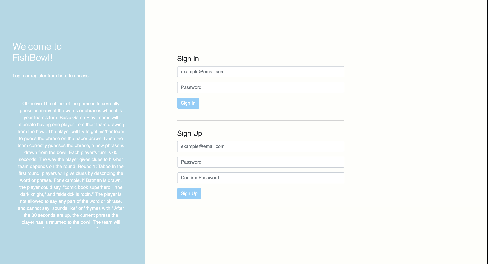
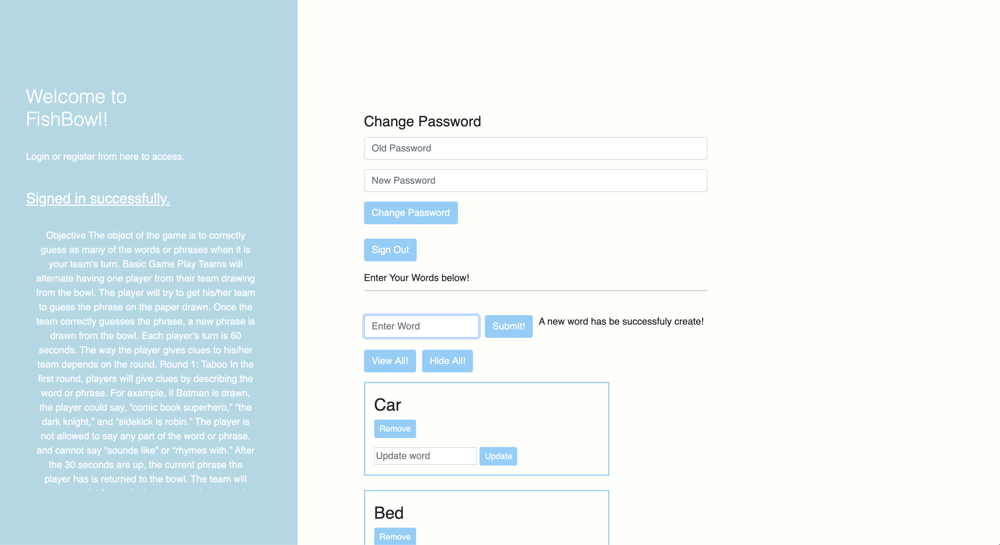

### Welcome to Fishbowl!

Fishbowl is a family-friendly party game that combines Charades, Password and Taboo. Players are split into two teams and have their score tracked through all three rounds. When a word is correctly guessed the player who scores adds a point to their team. The team with the most points wins!

**You can play** [here](https://nicksolie.github.io/fishbowl-client/)
**API Repo** [here](https://github.com/nicksolie/Fishbowl-api)

### Development

tackled this application with the lessons I learned from my tic-tac-toe project: more planning, sudo-coding and collaboration. I spent a chunk of my first day just scheduling and making a list of questions I had to resolve.  Using this approach I was able to solve out-loud a few requirements I was unsure about. As I starting coding, I would hit an issue I had already expounded on and be able to ask better questions.

I’m excited to see where this project goes over time. I believe once I complete further iterations I’ll have a fantastic app.
<!-- Since this is the first web development application I’ve built, my development process after an initial planning phase was effectively ad-hoc. I started by creating the game board itself so I could have a representation of the primary function of the application. I then used the game board layout to guide me through the user storied I created during planning.

A lesson I’ve learned from this project is to notice when unsuccessful problem solving turns into unsuccessful time management. -->

## User Stories and Wireframe

*My user stories from initial planning:*
As a user, I want to add words
As a user, I want to view my words
As a user, I want to edit my words
As a user, I want to delete my words

*My wireframe from initial planning:* :
https://imgur.com/a/qbXmJuu

*My ERD:* https://imgur.com/a/YwoO3HC
<!-- 

<!-- *The current version:* -->
*Sign Up / Login:*

*In-Game:*

###### These screenshots are a work from a work in progress and may not reflect the current version.

*ERD:* 

## Future Iterations

*Areas I see room for improvement:*

*Features*
- The inclusion of a shared words table so multiplayer can be enabled.
- A user should be able to get a random word from the words table.
- Track what words on the words table have been played and remove them.
- A user should be able to join a game by entering a game id.

*Styling*
- Create a footer that contains the change password feature once logged in.
- Make the instruction section scalable for mobile.
- Alter font size so it is more accessible for visually impaired
- Relocate alerts so they are closer to action buttons.

## Built With

*The technologies involved in this application:*
- JavaScript
- jQuery
- AJAX
- HTML
- CSS
- Git & GitHub

## Acknowledgments

Thank you to the wonderful staff at General Assembly, and my cohort, for helping me build my first web application!
